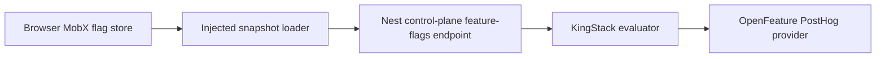

# CycleArena Feature Flags Integration Review

Reviewed: 2026-09-19, CycleArena commit `0ef1bd2d`.

Checkout: `/Users/mrpink/Documents/Code/VibeSessions/cyclearena`.

This is a static review of the first intended adopter. CycleArena was read only;
no application code, configuration values, services, or provider settings were
changed. File paths below are relative to that checkout. Runtime behavior and
deployed endpoint reachability remain implementation checks.

## Conclusion

The proposed library fits CycleArena without requiring a migration to the newest
KingStack runtime. Use its Nest control-plane API as the browser snapshot host,
inject a loader directly into the MobX flag store, and reuse existing analytics
and authentication infrastructure.

The review identifies concrete requirements for client ownership, identity,
activation, and package compatibility. Those need to be part of the initial
library contract, rather than workarounds in the adopter.

- Pros: PostHog, typed analytics events, bearer-token transport, session
  propagation, environment generation, and useful test suites already exist.
- Cons: guest analytics use multiple identity paths, the older singleton runtime
  differs from KingStack's current provider lifecycle, and the deployed Node
  target differs from KingStack's current package baseline.

## Existing integration points

| Concern | Evidence in CycleArena | Integration implication |
| --- | --- | --- |
| Nest deployment roles | `apps/nest/src/app.module.ts` loads `control-plane`, `game-worker`, or `both` | Mount the snapshot controller in `control-plane` and `both`; workers evaluate flags only if their own behavior needs them |
| Server PostHog client | `apps/nest/src/analytics/analytics.service.ts` owns a private, lazy `PostHog` client and shutdown hook | Factor reusable client ownership out of the analytics capture switch |
| Browser analytics | `apps/next/src/lib/analytics/clientAnalytics.ts` owns initialization, identify/reset, and event capture | Reuse this transport and its identity; avoid initializing a second browser SDK |
| Shared event contracts | `packages/shared/analytics.ts` exports `AnalyticsEvents` and context types | Add the flag catalog beside these contracts; preserve existing event keys |
| Browser session | `apps/next/src/stores/rootStore.ts` has `onSessionChange`, `sessionInitialized`, and `dispose()` | Add the flag store at this composition point; account changes must invalidate snapshots |
| Older store ownership | `apps/next/src/context/rootStoreContext.ts` constructs a module-level root store | Mount a browser lifecycle bridge; never hydrate personalized SSR values into that singleton |
| Existing direct Nest HTTP | `apps/next/src/lib/admin/moderationApi.ts` uses `NEXT_PUBLIC_NEST_BACKEND_URL` | The snapshot loader can follow the same direct-origin pattern |
| Configuration | `config/schema.ts` already maps `POSTHOG_KEY`, `POSTHOG_HOST`, and analytics enablement into runtimes | Add a separate flags selector while preserving existing key names and analytics behavior |
| Package runtime | `apps/nest/Dockerfile` uses Node 20 for build and runtime | Check supported engines and packed-package imports before choosing package defaults |

The manifests currently declare `posthog-js` at `^1.372.9` and `posthog-node`
at `^5.33.3`. These are declared ranges, not a claim that the latest OpenFeature
providers are compatible. Check installed versions and peer requirements in the
implementation spike. Searches of application/shared source found no existing
PostHog flag evaluation calls to migrate.

## Recommended snapshot route

A proposed endpoint is `${NEXT_PUBLIC_NEST_BACKEND_URL}/feature-flags`. Nest does
not currently set a global `/api` prefix. The browser calls it directly, with no
Next proxy and no connection to the selected game worker required.

Use CycleArena's `fetchWithAuth` from `apps/next/src/lib/utils.ts`, with explicit
response validation, cancellation, and no-store caching. Its
`apps/next/src/lib/admin/adminRequest.ts` demonstrates those transport concerns,
but the new loader should not depend on an admin-specific API contract.

Reuse `SupabaseJwtService` for signature verification and explicitly validate the
principal claims the flag endpoint accepts, including guest versus registered
identity. The flag endpoint needs its own access policy; do not reuse matchmaking
admission guards that require proxy signatures or Redis-backed admission state.
`apps/nest/src/main.ts` already permits `Authorization` through CORS. Verify the
actual control-plane origin and deployment policy during integration.

Create the control-plane flag module independently of `GameModule`.
`AnalyticsModule` is already used by both `RoomsModule` and `GameModule`, so
analytics is available in both deployment roles. Reuse a common client provider
without adding a dependency on the game loop to the snapshot service.

## Requirements revealed by the review

### 1. Provider ownership must be independent of analytics capture

`AnalyticsService.getPostHog()` returns `null` when `ANALYTICS_ENABLED` is false.
Using it unchanged would make flag evaluation depend on analytics being enabled.

Prefer a small application-owned PostHog client provider with one explicit
shutdown owner. Analytics capture continues to honor its switch; flag evaluation
honors the separate flags selector. The client may be needed when either is on.
An evaluator receiving that client must not shut it down on disposal. An
integration that creates its own client must arrange its own shutdown/flush.

Test all four combinations of analytics on/off and flags on/off. A shared client
does not imply shared enablement. Disable snapshot-generated exposure events
when analytics or experiment tracking is off.

Browser `posthog.init()` currently has no explicit remote-flag-loading option.
Verify the installed SDK's supported configuration and prevent a competing
browser flag-fetch path while preserving existing analytics and Session Replay.
Turning off KingStack polling alone is insufficient evidence of zero flag I/O.

### 2. Guest identity needs an explicit decision before guest experiments

There are three states: signed-out visitors, Supabase anonymous users who can
play, and registered users. Existing code uses these identity paths:

- `getAnalyticsAnonymousId()` prefers PostHog's `$device_id`, then its distinct
  ID, with a persistent `cyclearena_analytics_id` fallback.
- `AnalyticsProvider` calls `identifyAnalyticsUser(user.id)` for any Supabase
  session, including an anonymous Supabase user.
- `GameGateway.getAnalyticsDistinctId()` uses the analytics anonymous ID for
  guests and the player/user ID for registered users.
- Play-session capture can use the durable Supabase user ID for a guest, while
  other game events use the anonymous analytics ID.

These are different identifier paths in source. This review does not establish
how PostHog currently merges them. Simply making every flag targeting key equal
to the JWT subject does not prove guest experiment continuity.

Keep the verified request principal separate from the chosen experiment identity.
Agree on one assignment/exposure/outcome mapping for each account state and test
guest creation, account upgrade, sign-out, and another account signing in. A
client-supplied anonymous identifier must never confer authenticated permissions.
Do not generate a second anonymous ID system in the flags library.

The first experiment can target registered users while guest mapping is resolved.
Public landing-page flags would need an explicit anonymous snapshot path; the
existing authenticated transport requires a token. Anonymous IDs stored only in
the browser cannot provide personalized SSR by themselves.

### 3. Activation cannot assume the newest RootStore API

CycleArena initializes its session manager inside the root store constructor.
Its `AppProviders` does not own the newer KingStack `rootStore.mount()` lifecycle.

Construct an inert flag store in the existing root, forward identity changes
from `onSessionChange`, and activate/deactivate it through a small browser bridge
or feature demand. Include cleanup in root disposal and make acquisition safe
under React lifecycle replay. Keep provider imports and network work out of
module-level construction. Per-request SSR snapshots require separate ownership.

CycleArena's playground session path does not report a normal initialized
session through the same callback. Default/fixture mode must be ready without
waiting for Supabase readiness or acquiring a backend session.

Analytics identification currently happens in a React effect. If exposures are
added, coordinate identity readiness before emitting them; do not assume that
React effect order will synchronize analytics with a TypeScript flag store.

### 4. Reuse event contracts and scope gameplay decisions deliberately

`trackClientEvent` and Nest's `AnalyticsService.capture` accept typed
`AnalyticsEventName` values. Exposure integration needs either a deliberate
provider event adapter or a typed custom event. Do not bypass the catalog with
casts or emit exposures from ordinary flag reads.

For presentation experiments, record the assigned variant when the relevant
surface is encountered. For later gameplay flags, evaluate outside the simulation
tick. Decisions that affect shared match rules must be scoped and fixed for the
match, rather than independently refreshed for each player mid-round. Room/match
context belongs in the game integration; it is not a reason to build a game-aware
generic flag library.

### 5. Validate the actual consumer runtime

KingStack currently uses a Node 24 baseline, while CycleArena's Nest Dockerfile
uses Node 20. Decide the flags package's supported engines deliberately or plan
an explicit CycleArena runtime upgrade. Do not inherit a Node 24-only package
restriction accidentally from the logger example.

Smoke-test the packed package with CycleArena's Nest module output, TypeScript,
and Docker production dependency layout. The currently declared PostHog versions
also need compatibility checks before introducing the OpenFeature provider.

## First integration exercise

1. Install a packed/prerelease library in the consuming workspaces and add a
   project-owned catalog in `packages/shared/feature-flags`.
2. Add flags configuration, independent PostHog client ownership, and a snapshot
   endpoint to the Nest control-plane role.
3. Add the MobX store and direct Nest loader to the existing browser runtime.
4. Exercise one presentation flag for registered users, preserving current
   behavior as its default. Confirm provider substitution with fixtures.
5. If the proposed v1 experiment scope is included, test a presentation variant
   on the supporter offer card. It already records `SupporterOfferViewed` when
   at least half the card is visible, and has checkout/purchase outcome events.
   This is a candidate, not a selected product change. Preserve prices,
   entitlements, and purchase behavior.
6. Verify registered-user exposure against the existing Next webhook analytics
   in `apps/next/src/lib/commerce/supporterWebhookAnalytics.ts`. Guest experiments
   follow only after the identity mapping is verified.

For a custom exposure based on `SupporterOfferViewed`, attach the validated
assigned variant only when eligible, and configure matching PostHog exposure
criteria. Existing product telemetry should still work when experiments are off.
Current browser and Nest tests already cover identify/reset and analytics-disabled
behavior; extend those alongside new endpoint and store tests.

Acceptance evidence should cover direct Nest delivery, both server roles,
provider failure, account changes during an in-flight request, local playground
operation, independent analytics/flags switches, and exposure timing. A live
provider check and user-run browser verification are still required before
calling the integration production-ready.

See the [shared implementation plan](./feature-flags-plan.md) for the reusable
package contract and the separate Next-only acceptance path.
