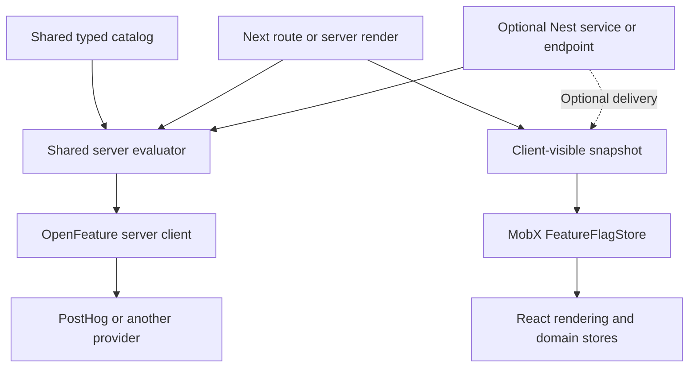

# KingStack Feature Flags Plan

Status: proposed; implementation has not started.

Date: 2026-09-19.

## Goal and decisions

Build `@kingstack/flags`, a reusable TypeScript library that gives KingStack
projects consistent feature flag definitions, evaluation, and client state across
Next.js and NestJS. Changing flag providers should preserve application flag
checks and browser components.

The agreed foundation is:

- OpenFeature supplies the provider abstraction; PostHog is the initial hosted
  provider.
- A project owns one typed flag catalog shared by its frontend and backend.
- Next and Nest use the same server evaluator.
- The browser reads evaluated snapshots through a dedicated MobX store.
- Next's `/api/feature-flags` route is the default snapshot endpoint and calls
  the evaluator directly. It does not proxy through Nest.
- Nest is optional. Adding Nest does not require moving the snapshot endpoint.
- Vercel's Flags SDK is an optional future Next integration.
- The core library requires neither Next, Nest, React, MobX, nor Supabase.
  Runtime integrations have separate entry points and optional dependencies.

### Pros

- One application contract works across Next-only and Next-plus-Nest projects.
- Provider integrations use an existing standard and ecosystem.
- Browser components remain independent of provider SDKs and endpoint location.
- A versioned package lets existing projects receive fixes through normal
  dependency upgrades.
- Typed definitions, explicit defaults, and deterministic fixtures make flag
  behavior easier to review and test.

### Cons

- KingStack must maintain snapshot delivery, lifecycle handling, and framework
  integrations.
- Remote evaluation adds latency; refresh frequency trades freshness for traffic.
- Providers differ in identity behavior, batching, flag types, and exposure
  tracking. A common API does not eliminate those differences.
- Migrating providers still requires migrating targeting rules and validating
  assignments. Rollout percentages do not guarantee identical user cohorts.

## Existing stack constraints

- `RootStore` coordinates session changes; domain state lives in TypeScript
  stores. React hooks are thin lifecycle bridges.
- Authentication at application service boundaries uses explicitly verified
  bearer tokens. Session cookies do not implicitly authenticate API requests.
- Frontend drafts can run without Supabase, Nest, or Postgres.
- `config/schema.ts` owns configuration inputs and generated environment files.
- `create-kingstack` uses an explicit template allowlist and published-package
  mapping. New files do not automatically ship to generated projects.

Follow the existing [state architecture](./state-management/README.md),
[authentication rules](./auth/README.md),
[configuration workflow](../config/readme.md), and
[draft composition pattern](./frontend-drafts.md).

## Ownership and package boundaries

Project definitions stay in `packages/shared/feature-flags`. The published
library contains reusable behavior, with no application-specific flags or
environment reads at import time.

Proposed entry points, to finalize during the initial implementation spike:

| Entry point | Responsibility |
| --- | --- |
| `@kingstack/flags` | Definitions, inferred types, validation, context and snapshot contracts |
| `@kingstack/flags/server` | OpenFeature-backed evaluation, snapshot creation, fallback diagnostics |
| `@kingstack/flags/mobx` | Observable snapshot store, refresh and identity lifecycle |
| `@kingstack/flags/react` | Optional context and thin lifecycle/access hooks |
| `@kingstack/flags/next` | Next route and server-rendering integration helpers |
| `@kingstack/flags/nest` | Nest dependency injection and lifecycle integration |
| `@kingstack/flags/testing` | Deterministic fixtures and snapshot loaders |

The application constructs its OpenFeature provider and injects its client into
the server evaluator. PostHog setup can be a documented recipe before adding
another KingStack provider factory. Reuse OpenFeature's existing Nest integration
where useful instead of duplicating it.

Server-only dependencies must not enter browser imports. A Next-only consumer
must install and run without Nest packages. Keep peer dependencies, package
exports, and emitted declarations consistent with those boundaries, following
the runtime separation already used by `@kingstack/logger`.

## Application API

The following is a proposed API, not currently available code:

```ts
// Project-owned shared catalog
import { booleanFlag, defineFlags, variantFlag } from "@kingstack/flags";

export const flags = defineFlags({
  newDashboard: booleanFlag({
    key: "new-dashboard",
    defaultValue: false,
    description: "Enable the new dashboard",
    clientVisible: true,
  }),
  checkoutLayout: variantFlag({
    key: "checkout-layout",
    variants: ["control", "compact"],
    defaultValue: "control",
    description: "Choose the checkout layout",
    clientVisible: true,
  }),
});

// Same evaluator API in Next server code and Nest services
const enabled = await featureFlags.evaluate(flags.newDashboard, {
  targetingKey: verifiedUser.id,
});

// Synchronous observable read in the browser
const enabledInBrowser = featureFlagStore.get(flags.newDashboard);
```

Types must be inferred from the catalog, including allowed variant literals.
Validate returned values at runtime too: unknown variants or incompatible types
resolve to the declared fallback and produce diagnostics. Reject duplicate
provider keys and invalid defaults when building the catalog.

Code owns keys, types, defaults, descriptions, and browser visibility. The flag
provider owns targeting and rollout configuration. A code declaration does not
create a flag in PostHog; the setup guide must include that step.

Begin with boolean and named string variants. Record an owner and cleanup
condition for temporary flags in project documentation. Arbitrary JSON payloads
and a general remote-configuration API can follow demonstrated demand.

## Evaluation and snapshot delivery



| Project setup | Default delivery |
| --- | --- |
| Next only | Next `/api/feature-flags` route |
| Next and Nest | Same Next route; Nest evaluates its own backend decisions |
| Project choosing Nest delivery | Inject a loader targeting its Nest endpoint |
| Server rendering with a verified context | Call the evaluator directly and seed the browser store |
| Frontend draft or unit test | Inject a deterministic snapshot loader |

One browser store has one configured snapshot source. Nest is never required
for the Next route, and neither server must call the other to evaluate a flag.
Both servers must use compatible provider configuration and targeting context.
Separate evaluations may observe different provider revisions during a rollout;
the design does not promise atomic decisions across services.

The snapshot contract should include a schema version, identity scope, evaluated
values, evaluation time, and enough status to distinguish fallbacks from resolved
values. Serialize only flags explicitly marked client-visible; visibility
defaults to server-only. Keep provider credentials, targeting properties, and
internal error details out of browser snapshots. Do not re-export private flag
definitions through a browser catalog entry point.

Expose named, bounded snapshot sets rather than evaluating every project flag on
every page. OpenFeature does not itself guarantee a single provider request for
multiple evaluations. Measure the actual PostHog request count in the spike;
reuse provider-supported batching or request-scoped results when necessary.
Avoid constructing a provider per flag or maintaining an unbounded global cache
of user results.

## Identity and authentication

The host application resolves a canonical context: a stable targeting key and
the trusted properties needed by its flag rules. The core library knows nothing
about Supabase. Next and Nest obtain authenticated context from their existing
token verifiers, never from a browser-supplied user ID or role.

- Protected snapshot calls use `fetchWithAuth` and `readJsonResponse` in the Next
  application; explicitly public calls use `fetchPublic`.
- An authenticated request with an invalid token fails authentication. Provider
  fallback behavior must not turn that failure into an authenticated snapshot.
- Use the same canonical identity for flags and PostHog analytics. Define the
  behavior of Supabase guest users and account upgrades explicitly.
- Token rotation updates credentials without changing the identity scope or
  forcing a refresh solely because the token changed.
- Public, unauthenticated targeting is opt-in. If enabled, use a project-scoped,
  persistent anonymous ID; the existing per-tab realtime `browserId` is unsuitable.
  Anonymous IDs select presentation and never confer authorization.
- Signed-out/default and draft operation must work without Supabase or hosted
  provider credentials. Reset anonymous identity appropriately on sign-out so
  a shared browser does not reuse the previous account's flag state.

Keep per-user context invocation-scoped or request-scoped. Never set a user's
identity on a process-global OpenFeature context shared by concurrent requests.

Authenticated server rendering is optional and requires an explicit, verified
server identity integration. The library must not silently introduce cookie
authentication to existing APIs. Without that integration, render the declared
fallback/loading state and load an authenticated snapshot after session readiness.
Bootstrap only when the server and browser identity scopes match. Public SSR
must also establish a stable anonymous identity through a response-capable
boundary before promising consistent personalized first-render values.

## MobX lifecycle and failure behavior

`FeatureFlagStore` owns the current snapshot, readiness, refresh status, and
last-update time. It accepts a snapshot loader and an initial snapshot, so the
same store works with either server or in-memory data.

`RootStore` coordinates session propagation and disposal. Flag logic stays in
the bounded flag store; components use narrow access hooks or receive it as a
dependency. Construction does not fetch. Activation starts demand-driven work,
and final release/disposal stops subscriptions, timers, and pending work.

Required behavior:

1. Start from catalog defaults or a validated, matching bootstrap snapshot.
2. Load when activated and the required identity is ready.
3. On account changes, immediately clear prior values and invalidate in-flight
   work. Use cancellation plus a generation check to reject late responses.
4. Refresh on relevant targeting changes and explicit demand. Support a
   configurable interval while active; choose its default from spike measurements.
5. On timeout, invalid values, or provider failure, use declared per-flag defaults
   and expose degraded status. Do not retain prior-user data or silently keep
   stale success values forever. Preserve valid results for other flags.
6. Coalesce concurrent refreshes and avoid retries per render. Browser `get()` is
   a synchronous read with no I/O or analytics side effects.

An unconfigured local project deliberately uses defaults. Explicitly selecting a
hosted provider with incomplete configuration should produce a clear configuration
error instead of masquerading as successful evaluation. Provider network outages
use bounded timeouts and declared fallbacks.

Snapshots are eventually consistent presentation state. Backend actions evaluate
their own flags with verified context and retain their existing authorization
checks. A client snapshot is not proof that a backend operation is allowed.

## Observability, exposure, and overrides

Use the existing logger for initialization failures, invalid values, evaluation
timeouts, and refresh failures. Capture evaluation duration, provider request
counts, and fallback counts without logging tokens or full targeting contexts.
Rate-limit repeated failure logs.

Separate snapshot retrieval from experiment exposure. Loading flags must not
automatically count every feature as viewed. PostHog's OpenFeature provider
supports `sendFeatureFlagEvents`; validate its behavior and deliberately configure
snapshot evaluation. Keep ordinary MobX reads pure. Define and test exposure
recording at the feature-use boundary before advertising experiment support.

Provide deterministic in-memory overrides for tests and frontend drafts. Any
later runtime override mechanism needs explicit local/development scope or
authenticated tooling; arbitrary browser overrides cannot control backend gates.

## Configuration and distribution

- Add optional provider configuration through `config/schema.ts`, its output
  mappings, and `config/example.ts`. Leave generated `.env` files to the config CLI.
- Default new projects to local/default behavior until configured. Allow PostHog
  project and regional host configuration per environment, with secret values
  restricted to server outputs.
- Begin with remote server evaluation. Enable local evaluation only after
  measuring polling cost, request volume, and cold starts for each deployment.
- Ship project-owned catalog and composition examples through the template.
  Ship reusable implementation as a versioned `@kingstack/flags` dependency.
- Update `PUBLISHED_PACKAGES`, `PACKAGES_TO_REMOVE`, and the template allowlist
  when the package and user guide are ready. Check Nest Docker dependencies if
  the Nest example consumes the package.
- Include a Changeset, package README, upgrade guidance for existing projects,
  and a packed-package smoke test. Coordinate template version references with
  an available release; publishing is a separate release operation.

The adoption guide should reduce setup to selecting a provider, configuring the
environment, adding the project catalog, and mounting the appropriate integration.
It must include a Next-only example and an optional Nest example.

## Implementation sequence

### 1. Validate the foundation

- Pin compatible OpenFeature and PostHog provider versions, including peer
  dependencies, and verify Node runtime compatibility.
- Exercise boolean and variant evaluation through the same server API in Next
  and Nest using PostHog and an in-memory provider.
- Measure snapshot request counts and latency; check timeout, initialization,
  shutdown/flush, and exposure behavior.
- Define the identity mapping, snapshot schema, refresh default, and batching
  strategy from these results. Confirm targeted variants map consistently.
- Probe a second hosted OpenFeature provider before claiming tested portability
  to it. In-memory substitution validates the interface but not another vendor's
  semantics. Use explicit support documentation for tested providers.

### 2. Build the package core and server evaluator

- Implement typed definitions, runtime validation, shared context, and snapshots.
- Inject OpenFeature clients; keep provider selection at application setup.
- Add lifecycle ownership, bounded failures, diagnostics, and testing utilities.
- Test request isolation, fallback behavior, variants, and snapshot filtering.

### 3. Complete the Next-only integration

- Add the Next snapshot route using existing auth and HTTP conventions.
- Add the MobX store and thin React bridge with identity-safe refresh/disposal.
- Wire a single example flag into the template and a deterministic draft fixture.
- Cover optional SSR hydration without making it a prerequisite for browser use.
- Verify no Nest package, service, or connection is needed.

### 4. Add the optional Nest integration

- Inject the same evaluator into a Nest service and connect shutdown handling.
- Demonstrate a backend decision using verified context and the shared catalog.
- Provide an optional snapshot endpoint recipe using the same DTO and browser
  loader contract. Keep the default Next endpoint unchanged.
- Run the provider substitution contract against both server integrations.

### 5. Package adoption and release readiness

- Add config mappings, generated-project examples, package boundaries, and docs.
- Exercise the packed package in a minimal Next-only consumer and a Nest consumer.
- Verify generated projects can start from defaults and later enable PostHog.
- Adopt in one downstream project and address integration friction before release.
- Complete focused tests, typechecks, formatting, and release metadata.

## Acceptance criteria

- [ ] Next-only projects evaluate and display flags without installing or running Nest.
- [ ] Core and browser imports do not pull in framework/server-only dependencies.
- [ ] Next and Nest use the same catalog and evaluator API.
- [ ] Replacing the provider changes setup/configuration, not feature checks or UI.
- [ ] In-memory/default mode works without network access or Supabase.
- [ ] Catalog types and runtime validation reject invalid defaults and variants.
- [ ] Concurrent users cannot share request context or cached personalized values.
- [ ] Account switching, sign-out, and late responses cannot restore previous-user flags.
- [ ] Snapshot responses contain only the allowed flags and use private, no-store caching.
- [ ] Provider errors, missing flags, and timeouts resolve predictably with diagnostics.
- [ ] Matching SSR bootstrap and initial client values agree; mismatched scopes are rejected.
- [ ] Browser reads trigger neither network requests nor exposure events.
- [ ] Active refresh, deactivation, disposal, and React lifecycle replay do not leak work.
- [ ] Measured request counts justify the chosen snapshot evaluation strategy.
- [ ] Generated-project setup and package installation boundaries are tested.

Run focused package/integration tests and TypeScript checks through Yarn. A full
Next build is only needed if package boundaries cannot otherwise be verified.
Do not start the dev server or perform visual verification; provide the user
with manual testing steps when the implementation is ready.

## Deferred work and open decisions

Deferred: direct browser-provider evaluation, arbitrary JSON flags, provider
management APIs, automatic flag creation, custom dashboards, streaming updates,
and automatic provider failover. The first release uses one selected provider
per configured runtime rather than combining providers during an evaluation.

Direct browser evaluation can later use OpenFeature's web SDK behind a separate
integration. It needs provider-specific identity and lifecycle support: PostHog's
web provider does not switch users from `targetingKey`; `posthog-js` owns identity.

Vercel's Flags SDK can later connect to the same OpenFeature client through
`@flags-sdk/openfeature` for Next-specific tooling. Decide separately how its
session overrides interact with Nest before promising overrides across servers.

Resolve during the spike: exact dependency versions, timeout and refresh defaults,
snapshot batching, first-render anonymous identity, the second hosted provider
to validate, and whether an initial experiment example is warranted. These do
not change the agreed requirement that Nest remain optional.

## References

Provider documentation reviewed during design on 2026-09-19; recheck APIs and
compatible releases during the spike.

- [OpenFeature Node.js SDK](https://openfeature.dev/docs/reference/sdks/server/javascript/)
  describes provider registration, invocation context, and lifecycle support.
- [OpenFeature NestJS integration](https://openfeature.dev/docs/reference/sdks/server/javascript/nestjs/)
  provides dependency injection and request-context integration.
- [PostHog OpenFeature providers](https://posthog.com/docs/feature-flags/installation/openfeature-js)
  documents server/web behavior, identity mapping, and exposure options.
- [Flags SDK OpenFeature adapter](https://flags-sdk.dev/docs/providers/openfeature)
  supports the optional Vercel integration and documents its limitations.
- [PostHog evaluation modes](https://flags-sdk.dev/docs/providers/posthog#evaluation-modes)
  describes the remote/local evaluation tradeoffs to measure.
- Repository standards: [MobX reactivity](../contribution-standards/mobx_reactivity.md),
  [domain stores](../contribution-standards/domain_stores.md),
  [thin hooks](../contribution-standards/hooks_are_thin_bridges.md), and
  [typed catalogs](../contribution-standards/typed_event_catalogs.md).
